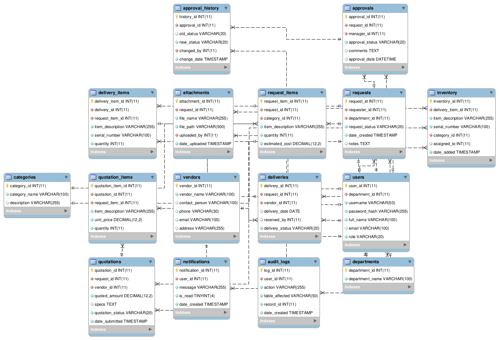

# IT Procurement Request System

An individual Object Oriented Programming II project for Year 2, Semester 1 of the B.Sc. Software Engineering programme.

The project is being built step by step using Java, JDBC, MySQL and NetBeans. Code comments explain what each part does in simple language.

## Current progress

- Created the database schema with 16 related tables.
- Reverse-engineered the database into an ER diagram using MySQL Workbench.
- Added a shared `DBConnection` class.
- Tested the Java connection successfully with a message window.

The login screen and procurement features have not been implemented yet.

## Tools

- Apache NetBeans IDE 31
- JDK 26 (current project configuration)
- XAMPP MySQL/MariaDB server
- MySQL Connector/J 26.7.0
- MySQL Workbench for the ER model

## Project files

- `src/itprocurementsystem/`: commented Java source code.
- `db/it_procurement_schema.sql`: database creation script.
- `db/it_procurement_er.mwb`: editable ER model.
- `db/it_procurement_er.png`: exported ER diagram.
- `db/`: PDF and SVG copies of the diagram.
- `nbproject/` and `build.xml`: NetBeans project configuration.

## Run the current connection test

1. Open this project in NetBeans.
2. Start MySQL in XAMPP.
3. Execute `db/it_procurement_schema.sql` using your MySQL connection.
4. Download MySQL Connector/J 26.7.0 and put its JAR in a `lib` folder in this project. The driver is not included in Git.
5. Check Project Properties → Libraries. If necessary, add the JAR using Add JAR/Folder.
6. Run `ITProcurementSystem`. A successful test displays **Database connected successfully!**

The local connection uses database `it_procurement_db`, server `localhost`, port `3306`, username `root` and an empty password. These are the local assignment settings; use appropriate credentials and connection security for any deployed system.

## Planned features

- User login for requesters, managers and purchasers.
- Equipment requests containing multiple items.
- Vendor quotations and manager approvals.
- Delivery tracking and inventory records.

We will build the Swing screens using NetBeans Design view and commit progress as each step is completed.

## ER diagram

