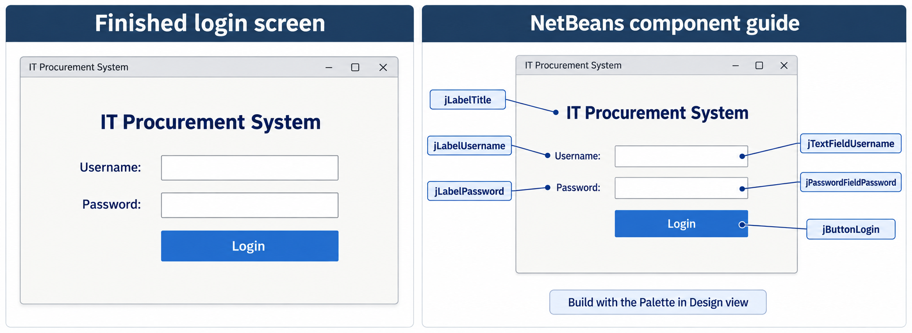

# Login frame design reference

This is a visual reference, not a screenshot of the implemented application. Build it in NetBeans Design view using three Labels, one Text Field, one Password Field and one Button. Window controls come from the JFrame itself. Callout labels belong only to this guide, not the application.

Suggested starting size: 600 × 440 pixels. Keep the fields the same width, align their left edges, and place the Login button below them. Fonts and button rendering may vary with the Swing look and feel.

| Component | Variable name | Display text |
| --- | --- | --- |
| Label | jLabelTitle | IT Procurement System |
| Label | jLabelUsername | Username: |
| Text Field | jTextFieldUsername | Empty |
| Label | jLabelPassword | Password: |
| Password Field | jPasswordFieldPassword | Empty |
| Button | jButtonLogin | Login |

Generated with the built-in image-generation tool. No application code or NetBeans layout was changed.

## Generation prompt

Use case: ui-mockup. Create a polished, precise visual design reference for a beginner's Java Swing NetBeans JFrame login screen for a GENERAL organization IT Procurement System (not a college). One landscape presentation image with two large panels side by side: left titled 'Finished login screen', right titled 'NetBeans component guide'. Left is a clean front-facing desktop window approximately 600x440 proportions, with subtle neutral title bar 'IT Procurement System', off-white background, generous padding, simple rectangular controls compatible with ordinary Swing, no imagery or logos. Within window a navy header label 'IT Procurement System' near top, then aligned rows: 'Username:' label and empty white outlined text field, 'Password:' label and empty white outlined password field, and a blue rectangular 'Login' button aligned with the fields below. ONLY these six components in the content area: title JLabel, username JLabel, username JTextField, password JLabel, password JPasswordField, login JButton. Elegant balanced professional spacing, legible sans-serif typography, navy text and muted gray borders, solid blue button, minimal square corners. No extra welcome label, subtitle, icons, checkbox, role selector, forgot password, registration or other features. Right panel repeats SAME screen layout with readable technical callout labels OUTSIDE the frame, fine leader lines to each of six components: 'jLabelTitle', 'jLabelUsername', 'jTextFieldUsername', 'jLabelPassword', 'jPasswordFieldPassword', 'jButtonLogin'. All annotations large legible and do not overlap. Include small note below the guide: 'Build with the Palette in Design view'. Image should look like a high quality UI specification board, crisp text, flat straight-on, no perspective, no laptop or environment, not a website. Both screen versions fully visible with spacious margins.
