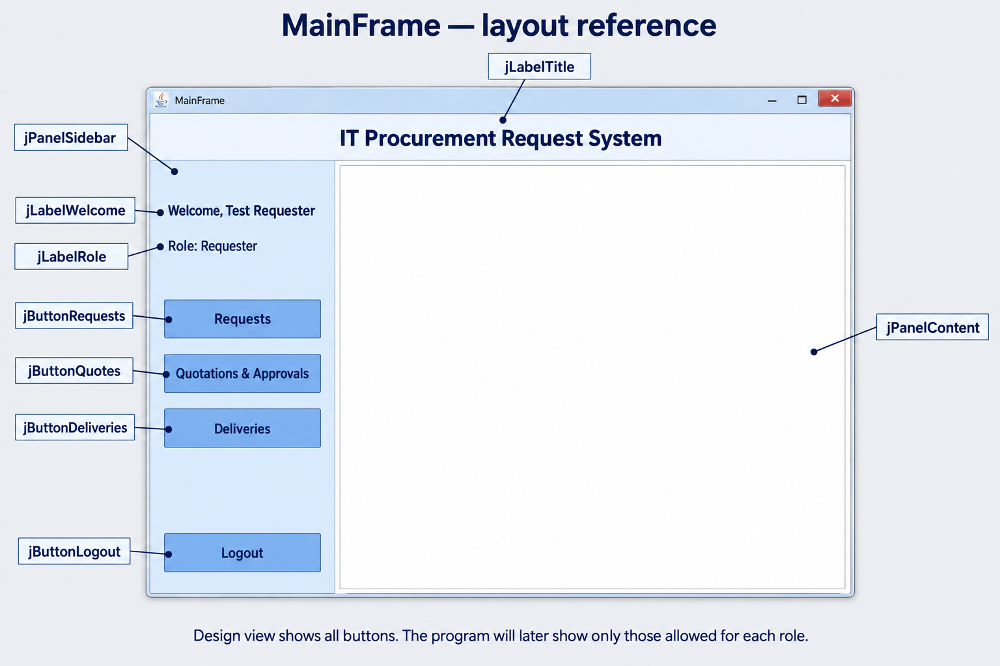

# MainFrame layout

This is a design reference generated with the built-in image-generation tool. The form is currently empty. Build the layout in NetBeans Design view; do not add the outside annotation boxes to the application.

1. Enlarge the form to roughly 1000 × 650 pixels.
2. Drag a Label across the top. Name it `jLabelTitle` and set its text to `IT Procurement Request System`.
3. Drag a Panel below the title on the left. Name it `jPanelSidebar` and make it roughly 240 pixels wide.
4. Drag another Panel to the right of the sidebar. Name it `jPanelContent`; leave it empty. This will hold our screens later.
5. Inside the sidebar, add two Labels: `jLabelWelcome` with text `Welcome` and `jLabelRole` with text `Role`. Code will fill in the logged-in user's details later.
6. Inside the sidebar, add four Buttons: `jButtonRequests` (Requests), `jButtonQuotes` (Quotations & Approvals), `jButtonDeliveries` (Deliveries), and `jButtonLogout` (Logout).
7. Stack the first three buttons under the labels and place Logout near the bottom. Use consistent button widths and spacing.
8. Save All. Do not add event code yet. All buttons are visible while designing; role checks will be added later.

The current form constructor has commented calls to initialize the components and center the window. Database login does not open MainFrame yet.

## Generation prompt

Create one high fidelity flat front-facing UI mockup image for a beginner Java Swing NetBeans JFrame called MainFrame, IT Procurement Request System for general organizations. This is a DESIGN VIEW REFERENCE, not a functioning dashboard. Show a complete desktop window 1000x650 proportions centered on pale gray background. A simple title label at top inside window says 'IT Procurement Request System' in bold navy. Below title, left a narrow very light blue sidebar JPanel around 240px wide, right a large EMPTY white content JPanel with fine gray border occupying most width. Sidebar contains a label 'Welcome, Test Requester' at top, a label 'Role: Requester' below, three stacked rectangular simple Swing buttons labeled 'Requests', 'Quotations & Approvals', 'Deliveries', and a 'Logout' button at bottom. No icons, photos, graphs, metrics, extra controls or curved custom components. Navy text, muted blue buttons, orderly generous padding, easy to build with default JPanel JLabel JButton and property settings. All three navigation buttons shown intentionally for design reference; small caption OUTSIDE WINDOW below says 'Design view shows all buttons. The program will later show only those allowed for each role.' Add outside-window callouts with thin leader lines labeling title 'jLabelTitle', sidebar 'jPanelSidebar', welcome label 'jLabelWelcome', role label 'jLabelRole', Requests button 'jButtonRequests', quotes button 'jButtonQuotes', delivery button 'jButtonDeliveries', logout 'jButtonLogout', blank right panel 'jPanelContent'. Text must be large readable and callouts neatly separated without overlapping. Heading above entire mockup 'MainFrame — layout reference'. Plain white right content panel has NO controls or placeholder text inside. No invented functionality. High quality crisp typography and spacing.
