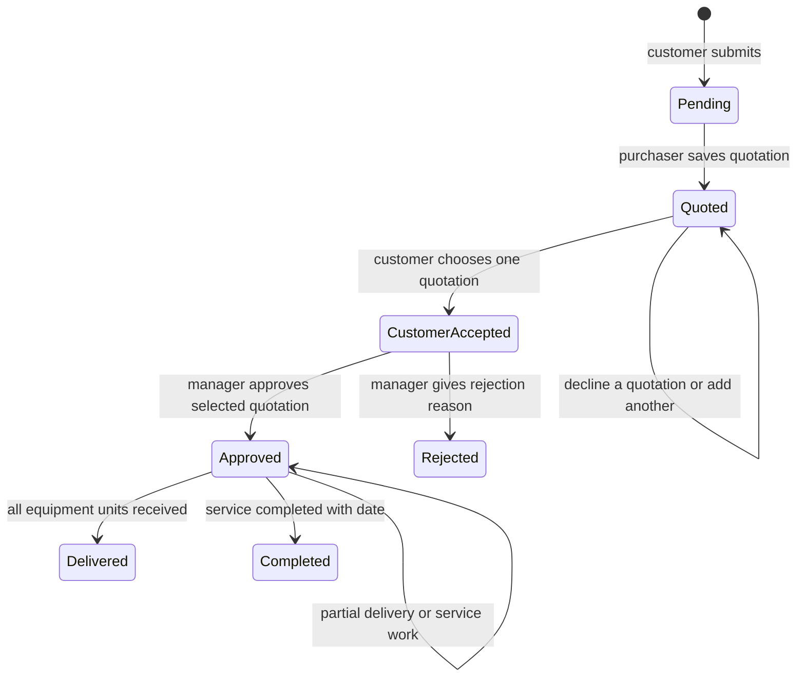
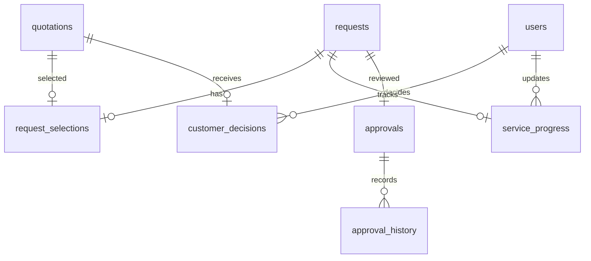

# Current workflow update — 3 October 2026

The current flow is documented in README.md. New requests use saved catalogue selling prices; customers confirm orders in My Orders. Managers independently select internal supplier quotations. Only Admin manages users/departments and catalogue prices. The database now has 21 tables. Password recovery, gender and PDFs are implemented.

The material below describes the previous quotation-selection workflow and remains as historical notes for pre-catalogue records.

# Workflow and data relationships

## Request lifecycle

Customer acceptance and staff approval are distinct. Neither account type automatically bypasses the customer's choice. Staff review authorises fulfilment by this procurement system, not approval by an outside organisation's department.

## Added ER relationships

The primary key of `request_selections` is `request_id`, so each request has one final selected quotation. The transaction checks that the quotation belongs to that request. The manager must select the same quotation, and the choice cannot change after approval.

## Why transactions matter

A transaction saves related records together. If an item insert fails, rollback undoes the request, delivery or decision instead of leaving half a result. Delivery transactions lock the parent request while counting received units. READ COMMITTED ensures a purchaser waiting for a lock sees the previous purchaser's committed delivery. Unique serial-number constraints prevent the same physical unit being entered twice.

Filesystem copies are not database rows. Request saving tracks each new attachment copy and deletes those copies if the database operation fails.

## Scope of verification

The integration suite uses a fresh database on a different port, not the user's saved records. It checks successful workflows, invalid transitions, duplicate serials, overdelivery, rollback, authorisation, registration uniqueness, concurrent choices and concurrent deliveries. It also constructs all 12 Swing panels on the Swing event thread with a real test database.

The normal MySQL service was stopped during development. No claim is made that the three JFrame windows or a full manual desktop run were verified on that service. Start it in XAMPP and run the project for that final local check.
